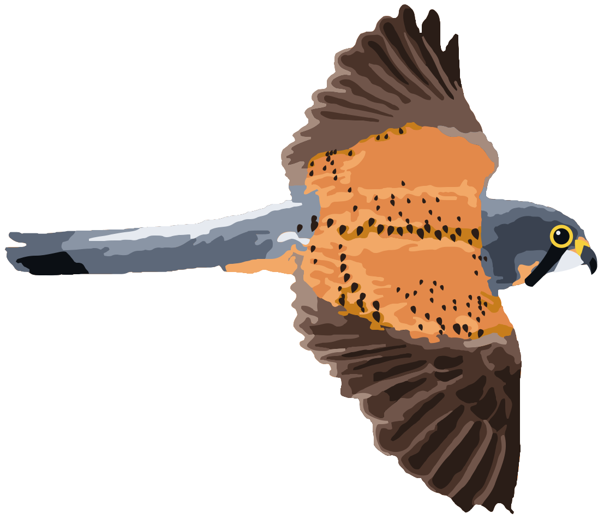
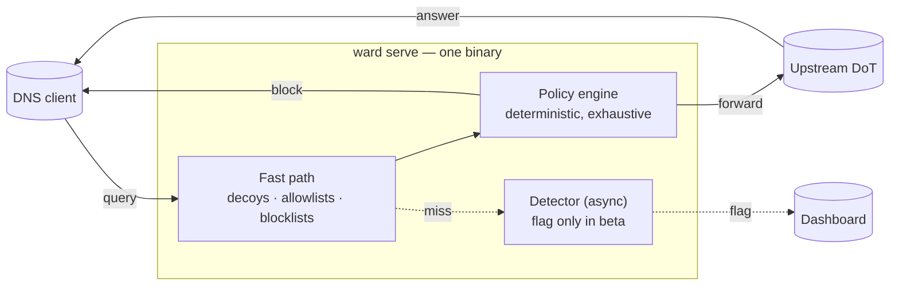

<div align="center">
  

  <h1>Protocol Ward</h1>

  <p><em>Quiet observation. Deterministic strike.</em><br/>
  <sub>DNS-layer defence on hardware you own. Nothing is sent off-device for analysis.</sub></p>

  <p>
    
    
    
  </p>

  <p>
    <a href="https://protocolward.ai"><strong>Docs</strong></a> ·
    <a href="https://protocolward.ai/demos/behavioral/"><strong>Behavioral demo</strong></a> ·
    <a href="https://protocolward.ai/demos/decoys/"><strong>Decoys demo</strong></a> ·
    <a href="#install"><strong>Install</strong></a> ·
    <a href="#roadmap"><strong>Roadmap</strong></a> ·
    <a href="docs/product/pitch.md"><strong>Pitch</strong></a>
  </p>
</div>

> **Beta — expect breakage.** Config keys, CLI flags and log lines may change between releases without notice. The behavioral detector flags and never blocks. Please report what breaks.

---

On 31 March 2026, someone used a hijacked maintainer account to publish `axios@1.14.1` and `axios@0.30.4`. Both pulled in a new dependency whose postinstall script installed a remote-access trojan; on macOS it landed in `/Library/Caches/`. Every check upstream of `npm install` passed. The trojan still had to reach its server, and stopping that is the one job Protocol Ward does. The command-and-control domain was registered the day before, so no list knew it at the time; the timing and per-device-history signals aimed at that pattern are coming soon, and today you stop it by adding the domain to a list.

Ward is a DNS resolver that sits at the edge of your network, on hardware you control, and decides which names your devices may resolve. It is not a supply-chain scanner. It does not audit tarballs or sandbox postinstall scripts. It is the layer that is still there after every upstream check has been bypassed. The longer argument is in [docs/product/pitch.md](docs/product/pitch.md).

## What it does today

Per query, decoys are matched first (a decoy is never forwarded), then allowlists, then blocklists, then the query is forwarded upstream. The detector runs only after a forward, and only flags.

### Blocklists — fast path

Names on your lists are answered with your configured block response, with the list and rule in the log. Ward reads hosts-format or AdGuard-format lists, so the hosts-format or AdGuard-format exports of public lists such as OISD, Hagezi and StevenBlack work without conversion. Bare-domain lines (a name with no address) are skipped with a warning, so a mixed file still loads, but a file with no usable entries fails to load. AdGuard exports' `[Adblock Plus]` and `!` header lines also produce warnings but the file loads. Allowlists take precedence.

> **Example — TanStack, May 2026 (CVE-2026-45321).** 84 malicious versions of 42 `@tanstack/*` packages sent stolen credentials out through `filev2.getsession.org` and `seed1`–`seed3.getsession.org`. The advisory names domain blocking as the only network mitigation. Put `getsession.org` on a list and that route is closed.

### Behavioral detector — on-device, flag-only (beta)

The detector is opt-in: set `model: { builtin: lexical }` in your config. When enabled, Ward analyses each hostname that misses your lists on-device, skipping local names and OS connectivity checks; **timing and per-device history are coming soon**. The built-in detector scores the name itself (randomness, rare letter sequences, digits, consonant runs, length) and raises a flag on names that look machine-generated, such as DGA domains. In the beta it **never blocks**. Flags show on the dashboard with their reasons, and you add a name to a blocklist to enforce. → [Try it in your browser](https://protocolward.ai/demos/behavioral/): Ward's real Go code compiled to WebAssembly, with nothing sent off-device for analysis.

### Decoys — tripwire hostnames

You configure names that nothing legitimate on your network ever resolves, such as `nas-backup.home.arpa`. A lookup is a high-confidence sign that something is enumerating your network, and Ward raises an alert with attribution. No model runs. Decoys never appear in `ward config export` ([invariant 6](docs/engineering/invariants.md)). → [Try the decoys demo](https://protocolward.ai/demos/decoys/).

**The AI classifies. The deterministic policy engine decides.** Classifiers emit a typed verdict; the policy engine is a stateless Go function with an exhaustive case for every verdict. In the beta, built-in detector verdicts only raise a flag, and an external classifier's verdicts are only logged. A model never has direct effect on whether a query is answered, and the DoD harness checks that import boundary on every `make dod` run ([invariant 1](docs/engineering/invariants.md)).

## Install

```bash
go install protocolward.ai/ward/cmd/ward@latest   # Go 1.25+
ward version
```

Ward runs on Linux and macOS. Windows support is planned for the future.

Docs, quickstart and configuration reference: **https://protocolward.ai**.

From source:

```bash
git clone https://github.com/ujjaval-verma/protocolward.ai.git
cd protocolward.ai
make bootstrap          # pinned tools + git hooks (needs pre-commit installed)
make ci                 # lint + vet + race tests + build
./bin/ward version
```

`listen` is required in `ward.yaml`; there is no default bind address. The examples use `127.0.0.1:5354` because on macOS port 5353 belongs to `mDNSResponder`.

<details>
<summary><b>Block real tracker domains and see flags in 30 seconds (from a clone)</b></summary>

The repo ships a 42-domain demo blocklist at [`testdata/blocklists/trackers-demo.txt`](testdata/blocklists/trackers-demo.txt).

Needs `dig` (from `dnsutils` / `bind-tools`, preinstalled on macOS) and a built binary (`make build`; the full `make ci` above is not required).

```bash
cat > /tmp/ward.yaml <<'EOF'
listen: "127.0.0.1:5354"
upstreams:
  - address: "1.1.1.1:853"
    server_name: "cloudflare-dns.com"
timeouts: {dial: "2s", query: "2s", shutdown: "2s"}
blocklists:
  - id: trackers
    path: ./testdata/blocklists/trackers-demo.txt
model:
  builtin: lexical
EOF

./bin/ward serve --config /tmp/ward.yaml &
sleep 1

for h in doubleclick.net google-analytics.com criteo.com wikipedia.org github.com qwkjxzpvtr.net; do
  printf "%-28s → %s\n" "$h" "$(dig @127.0.0.1 -p 5354 $h +short | head -1)"
done

echo "Open http://127.0.0.1:18987 and look under flags for qwkjxzpvtr.net"
read -r -p "Press Enter to stop ward serve " _
kill %1
```

Trackers return `0.0.0.0`; everything else is forwarded. `qwkjxzpvtr.net` is a machine-generated-looking name: it is forwarded too and comes back empty because the name does not exist upstream (the detector flags, it never blocks), and while the server is running it appears under **flags** on the dashboard at http://127.0.0.1:18987 with its score and reasons. For real use, add a maintained list under `blocklists:`.

</details>

## Roadmap

### Shipped
- Fast-path blocklists and allowlists from hosts-format or AdGuard-format lists, with attribution in every log line
- Decoy tripwire hostnames with alerts; decoy-free `ward config export`
- DNS-over-TLS upstreams; `ward doctor` (bind and upstream checks)
- Read-only web dashboard
- Offline verification of signed update bundles (`ward update verify`)
- Classifier contract with sibling-process isolation; `ward eval` harness

### Beta
- On-device lexical hostname detector, **flag-only**
- In-browser demos running Ward's real code as WebAssembly

### Coming soon
- Timing and per-device history signals
- Enforcement mode for detector verdicts
- Optional local LLM explainer
- Roaming mode (laptop off-LAN, tunnelled home)
- Native macOS client
- Managed, signed blocklist feeds

Details: https://protocolward.ai/roadmap/.

## Architecture



Full design: [`docs/engineering/architecture.md`](docs/engineering/architecture.md). Invariants: [`docs/engineering/invariants.md`](docs/engineering/invariants.md). Decisions: [`docs/engineering/decisions/`](docs/engineering/decisions/).

## Security

There is no PR CI during the beta; local hooks are the gate ([ADR-0002](docs/engineering/decisions/ADR-0002-security-posture.md)). Pre-push runs lint, vet, race tests, `go mod verify` and `govulncheck`. Report vulnerabilities privately: [`SECURITY.md`](SECURITY.md).

## The kestrel

Kestrels hover still above a field, then drop. The mascot is the character; **Protocol Ward** is the product. Brief: [`docs/design/mascot.md`](docs/design/mascot.md).

## Contributing

Pull requests are welcome. Every commit needs DCO sign-off (`git commit -s`), and `make ci` must pass locally. See [`CONTRIBUTING.md`](CONTRIBUTING.md) (including the [repository layout](CONTRIBUTING.md#repository-layout)). [`CLAUDE.md`](CLAUDE.md) holds the same rules for AI coding agents.

## License

Apache License 2.0 for the whole repository ([`LICENSE`](LICENSE)). Free for any use, including commercial. Copyright and third-party attributions: [`NOTICE`](NOTICE). Contributions are Apache-2.0 under DCO sign-off ([`CONTRIBUTING.md`](CONTRIBUTING.md)).
